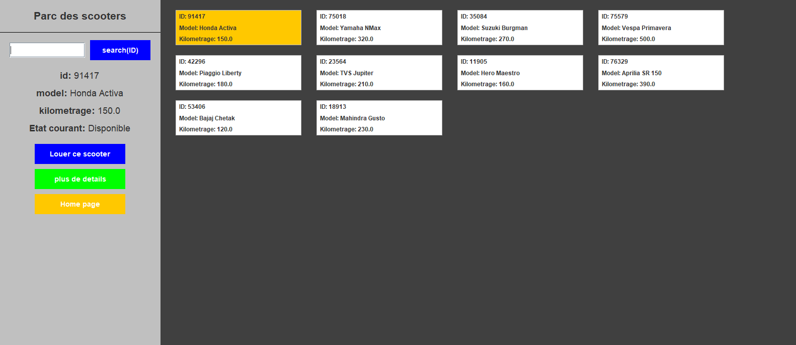
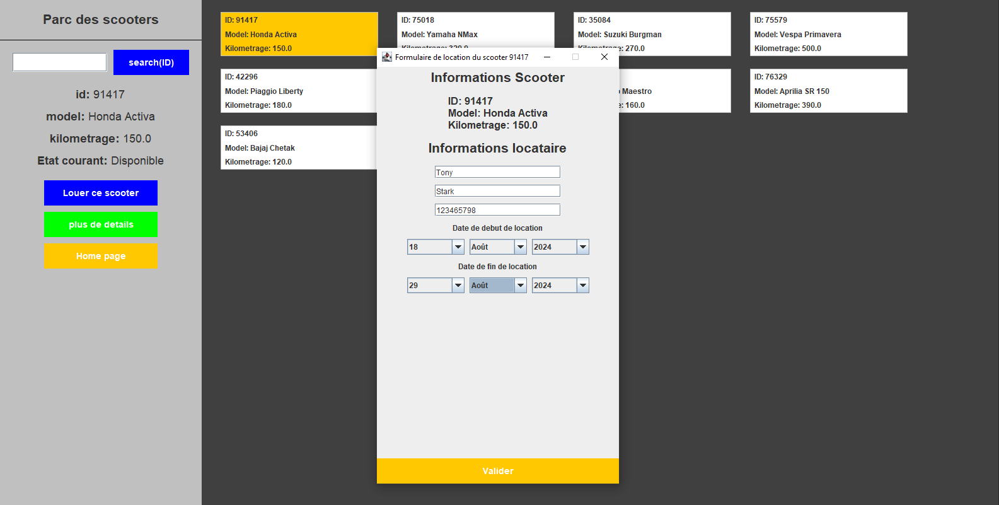

# Scooter Station Management System
## Overview
The Scooter Management System is a desktop application designed to manage a scooter rental business. This application provides functionalities for inventory management, rental operations, and administrative controls, all built with Java using object-oriented programming principles.

## Features
- Inventory Management: Create, delete, and manage scooters in the system.
- Rental Operations: Track scooter rentals, calculate usage based on distance, and ensure no double bookings.
- Admin Authentication: Secure admin login to access management features.
- User Interface: Intuitive UI designed with Java Swing and AWT.

## Technical Stack
- Programming Language: Java
- GUI Framework: Java Swing, AWT
- Database: Embedded H2 Database
- Security: Custom authentication mechanism for admin access

# Screenshots
> [!NOTE]
> The project is presented in French.
### Scooters parc display

### Renting a scooter

## Challenges and Solutions
### Concurrency Management:
- Ensuring no double bookings for scooters was handled using synchronized methods and database locks.
### User Interface Design:
- Creating an intuitive and responsive UI using Java Swing and AWT.
### Data Persistence:
- Implemented using an embedded H2 database to ensure data consistency and reliability.

## Contributing
Contributions are welcome! Please fork the repository and submit pull requests.
